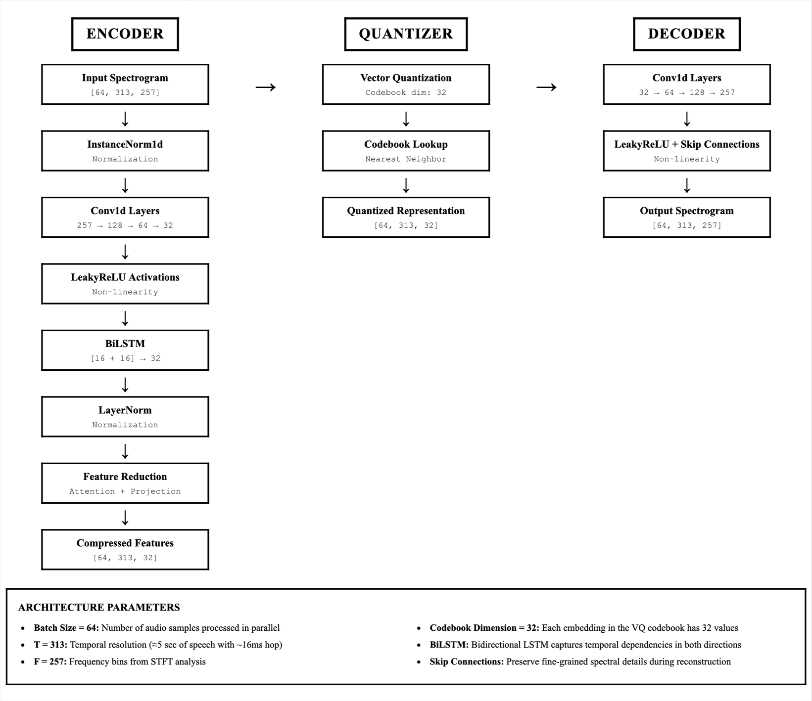

# SSQE-CleanSpeech
**Self-Supervised Quality Estimation of Speech Using Only Clean Data**
This project proposes a self-supervised framework for speech quality estimation without the need for paired noisy-clean data. Inspired by [VQScore](https://github.com/JasonSWFu/VQscore), our method leverages only clean speech during training to estimate perceived quality, enabling efficient and scalable quality modeling.

The approach uses a vector quantization-based architecture with an encoder-quantizer-decoder structure, incorporating BiLSTM for temporal modeling and integration of prosodic features.
Architecture:

## References

1. [**VQScore**](https://github.com/JasonSWFu/VQscore/tree/main) 

2. [**Prosodic Features**](https://github.com/CeLuigi/prosodic_features)
